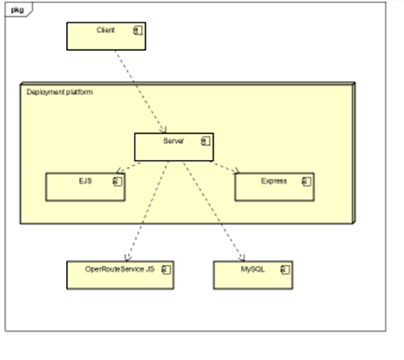

# Deployment

## Version 1.0.0 Release Notes
Application now meets high-level requirements after testing. User's will be able to choose routes on a map, find their local area's crime rates and see crime trends over time in bristol. All systems are tolerant with error responses for user feedback.

### Dependencies & Software Tools

ejs - 3.1.7
express - 4.17.3
mysql - 2.18.1
openrouteservice-js - 0.1.31
MySQL workbench

### Known issues
ORS map doesn't doesn't display until after the page is loaded.

The system's (Pathfinder) relationship with the deployment platform and its dependencies. 

# User guide

## User guide based on user cases

### UC1 user guide
Index page shows options for each use case option, select find a route button in the center of the screen or beneath the search bar. On the pages loading select a position and ORS will give an interface for you to select your destination. ORS will then generate a route for you to travel.

### UC2 user guide
Index page shows options for each use case option, select the search bar just beneath the banner of the page. Input your chosen ward that you want to find crime statistics on and click the magnifying glass to submit. This will send a query to the database and return with a table of crime data for any ward similar to your search. This is displayed in full to make the data easily searchable (althought in this use case the rows shouldn't exceed 20). From here you can search again or return to the index page.

(images/userguide1.png)

### UC3 user guide
Index page shows options for each use case option, select search for local crimes to be able search for specific crime rates. The colour coded Map on the right shows ward crime rates with brighter colours having higher crime rates. From this page you can select how you wish crime rates to be displayed. Value for number of crimes displays them as an absolute number. Value from crime relative to population. The other two buttons will show extra subcategories. This enables you to differentiate to decide risk factors that you may weight higher than others, or for deeper analysis to be performed on the data. Following your selection the submit button will generate your query. The table will then be displayed, the records are displayed without limit to allow easy access and for searching with browser support. From here you can use the buttons at the top to return to the crimedata page to create another query. 

(images/userguide3.png)

(images/userguide4.png)

### UC4 user guide
Index page shows options for each use case option, select the bright red "report a crime" at the bottom of the page to be able add your crime to the database. A form will be displayed where you can input the details of the crime. The database will be updated only with those marked with an asterisk, this is to protect users from giving sensitive data that may break confidence in the application, however the addition of filing a police report is added for those that wish to. Once your data is correct click submit and the database will be updated with your values. To confirm the database was updated successfully you should be sent to a new webpage that will redirect you back to the index page.

(images/userguide5.png)

(images/userguide6.png)

(images/userguide7.png)

(images/userguide8.png)

(images/userguide9.png)

(images/userguide10.png)

