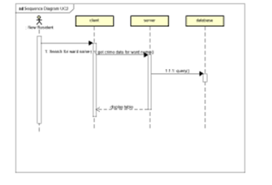
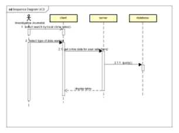
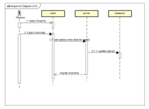
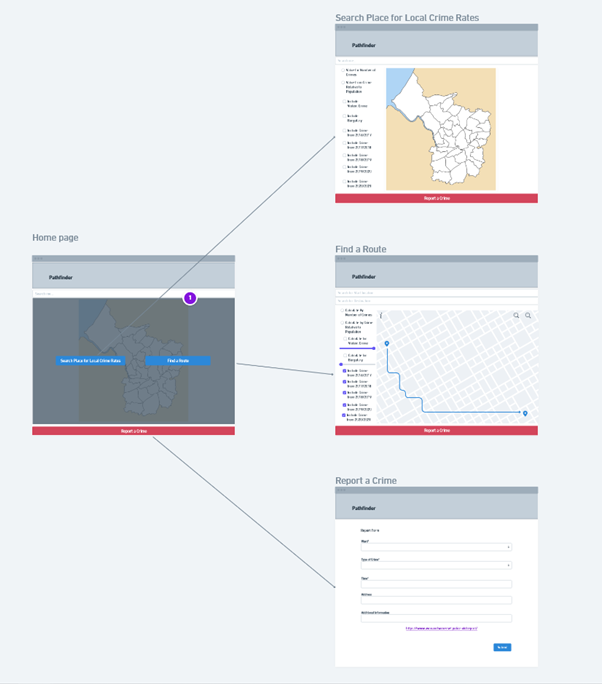

# Design

## Behavioural design

### UC1 - Someone is trying to travel from outside the city to inside the city and wishes to plan their route while being mindful of crime rates
1. select choose a route
2. User chooses point on map
3. User selects a second point on the map
4. ORS servers displays route

### UC2 - A new resident is looking to move into Bristol with their family they wish to find a nice location and are stuck between Brislington and Stoke bishop
1. new resident enters ward name in search bar and submits
2. client sends ward name search data 
3. server sends query for crime data records with similar ward name data
4. database returns crime rates for records with that ward name to server
5. server sends webpage with records to client
6. client displays table

### UC3 - Investigative Journalist wants to find out about violent & sexual crime rate trends in sections of bristol,
1. Investigative journalist selects search for local crime rates
2. Investigative journalist select value from crime relative to population
3. Investigative journalist select violent crime 
4. Investigative journalist submits
5. client requests data for table record for user's selection
6. server sends query to database 
7. database returns records from matching columns
8. server sends webpage with records to client
9. cient displays data to user

### UC4 - A recent witness of a crime in city centre wishes to remain anonymous while ensuring the crime doesn't happen to someone else 
1. Witness selects report a crime
2. witness inputs details and submits
3. client sends request to update values for that ward
4. server sends update query to database
5. server returns response to client

## User Interface design
Wireframe mockup of app

