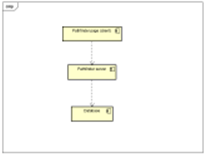

# Implementation

## Introduction
The system takes a dataset of crime rates across bristol wards they're separated into different types, ward name and code. The system enables the user to use a map to decide a route using OpenRouteService. The system will render a table for the user by interfacing with the database. As specified in the use cases these are both getting and setting data to and from in the system.

## Project Structure

### Project folder structure
```
├── conf.json
├── docs
├── main.js
├── node_modules
├── package-lock.json
├── package.json
├── static
└── Views
```

### jslint report
✖ 0 problems (0 errors, 0 warnings)

## Software Architecture#
The system's architecture are split into 3 tiers by each main components: the web app(page), server and database. The server will run using node.js to interface with the MySQL database.



