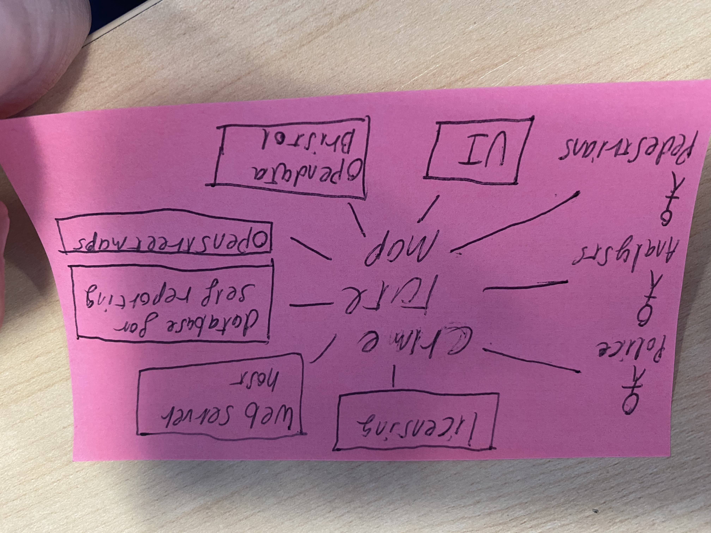

# Project Proposal

## Business Case

### Problem statement
This project enables users to be able to access crime data information so that they can avoid areas with crime rates or of specific types of crime they may wish to personally avoid. The project will also make this data more accessible to users instead of using the direct dataset by presenting it in a relevant context to the user.
simple and presentable access to crime rates for the user's local area.

### Business benefits
This app could reduce crime in bristol and help reporting of crime within bristol in turn benefitting policy decisions and research into crime. A benefit to a business that would support the apps development could be the user data.
Please note however, it would negatively affect the app to be perceived as user data collection app as people would lose confidence in the app upholding their privacy especially in the case of information that is so sensitive, therefore crowdsourcing could be a better source of funding.

### Options Considered
There 2 similar apps called Safe & the city & RedZone, these apps were limited to U.S.A and london. They're nioche but successful, this shows the premise of the app has potential. Other online map services like google maps and open street maps could compete with the map section of the application. These should be overcame by USP of Bristol and use of crime data.

### Expected Risks
limited user features may not engage users with the app for a long period of time
deadlines are exceeded, inconsistent design within portions of the app.

## Project Scope
TODO: Scope of the System of Interest. Include a bullet list of things from your context diagram that are in scope.

* Analyst
* Police
* Bristolian
* Open Data License
* Open Data Bristol
* Database
* App/Web hosting
* Desktop & Mobile UI

