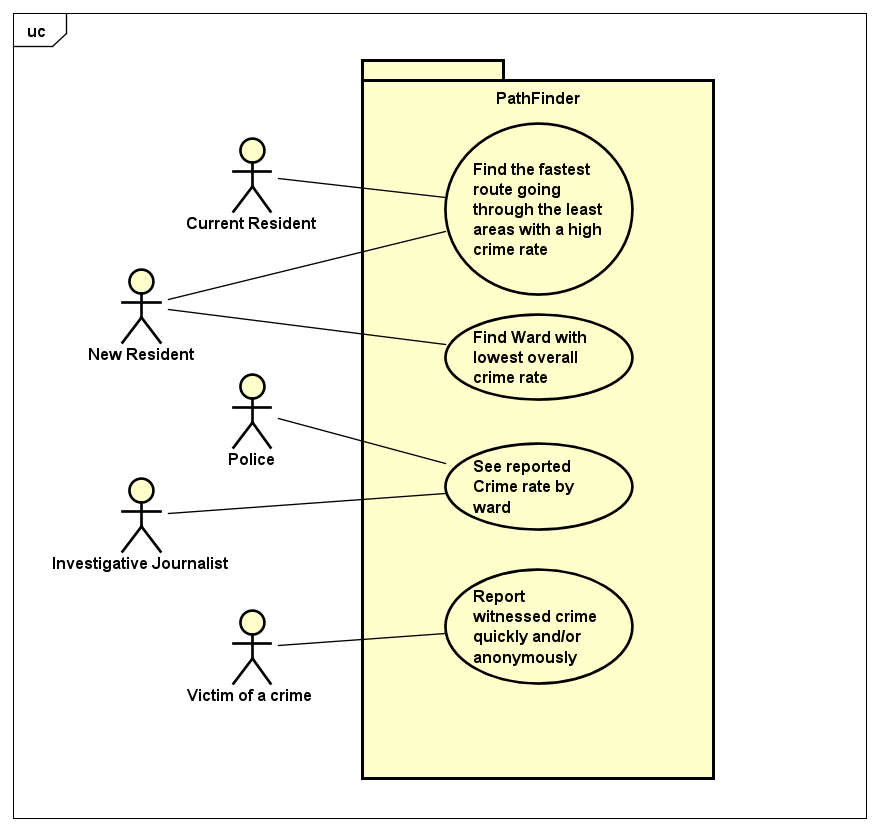

# Requirements

## User Needs

### User stories
As a bristolian, I want to avoid areas of high crime by using the map as to not be a victim 
As Investigative journalist, I want to be aware of reports of crime in Bristol and the consequences.
As a new resident i want move into an area with a low crime rate, so my family are not affected.
As a witness of a crime i want to report the crime anonymously to prevent others being affected without involving the police.

### Actors
Police
Investigative journalist - Someone interested in investigating crime statistics for bristol
New resident - New resident to bristol who wants to find a low crime area for his home
Bristolian - Someone living in bristol wanting to know dangerous areas of bristol
Witness - Witness of crime who may want report it without police intervention

### Use Cases
| UC1 | Find the fastest route going through the least areas with a high crime rate | 
| -------------------------------------- | ------------------- |
| **Description** | As a bristolian, I want to avoid areas of high crime as to not be a victim |
| **Actors** | Bristolian |
| **Assumptions** | Browser supports geo-location</td></tr>
| **Steps** | 
1.	User selects path option
2.	Choose destination
3.	Request user location 
4.	User gives permission
5.	User designates weight for crime type
6.	Calculate fastest route avoiding wards with high crime rate of type
7.	Display route |
| **Variations** | User doesn’t give or browser doesn’t support geolocation |
| **Non-functional** | TODO: OPTIONAL - List of non-functional requirements that the use case must meet. |
| **Issues** | TODO: OPTIONAL - List of issues that remain to be resolved |

| UC2 | Find Ward with lowest overall crime rate | 
| -------------------------------------- | ------------------- |
| **Description** | As a New resident, I want to avoid areas of high crime by using the ward table so i can move  |
| **Actors** | New resident, New business owner |
| **Assumptions** | Browser supports scripts</td></tr>
| **Steps** | 
1.	User selects Crime Map
2.	Display colour coded map of ward crime rates
3.	User selects specific ward
4.	Display ward crime data |
| **Variations** | N/A |
| **Non-functional** | TODO: OPTIONAL - List of non-functional requirements that the use case must meet. |
| **Issues** | TODO: OPTIONAL - List of issues that remain to be resolved |

| UC3 | See reported Crime rate by ward | 
| -------------------------------------- | ------------------- |
| **Description** | As Police, I want to be aware of reports of crime in Bristol and the consequences |
| **Actors** | Investigative journalist, Police |
| **Assumptions** | Neither groups are dismissive of user reported data</td></tr>
| **Steps** | 
1.	User selects Crime Map
2.	Display colour coded map of ward crime rates |
| **Variations** | N/A |
| **Non-functional** | TODO: OPTIONAL - List of non-functional requirements that the use case must meet. |
| **Issues** | TODO: OPTIONAL - List of issues that remain to be resolved |

| UC4 | Report witnessed crime quickly and/or anonymously | 
| -------------------------------------- | ------------------- |
| **Description** | As a Witness of a crime, I want to report anonymously to lower chance of someone else being a victim |
| **Actors** | Witness |
| **Assumptions** | Neither groups are dismissive of user reported data</td></tr>
| **Steps** | 
1.	User selects Report
2.	User reliability is checked
3.	Display report form
4.	User fills form for ward, type of crime, 
5.	User fills form for name, place, time and date |
| **Variations** | N/A |
| **Non-functional** | TODO: OPTIONAL - List of non-functional requirements that the use case must meet. |
| **Issues** | TODO: OPTIONAL - List of issues that remain to be resolved |

TODO: Your Use-Case diagram should include all use-cases.

## Software Requirements Specification
### Functional requirements
    FR1: The system should get user geo-location (UC1)
    FR2: The system must display to the user the route from two locations on a map (UC1)
    FR3: The system won't take into account crime rates when creating a route (UC1)
    FR4: The system must show ward by crime rate (UC2)
    FR5: The system should only show other crime rates if the user specifies (UC2)
    FR6: The system must show crime rate by year (UC3)
    FR7: The system must show crime rate by ward (UC3)
    FR8: The system should show a bristol map by colour coded by crime rate(UC3)
    FR9: The system must add user reports to a database (UC4) 
    FR10: The system could validate user input for reporting using a captcha (UC4) 
    

### Non-Functional Requirements
TODO: Consider one or more [quality attributes](https://en.wikipedia.org/wiki/ISO/IEC_9126) to suggest a small number of non-functional requirements.
Give each non-functional requirement a unique ID. e.g. NFR1, NFR2, ...
    NFR1: The map must fill over half the page(UC1)
    NFR2: The map must not conflict with or cover any other element on the page(UC1)
    NFR3: Table should highlight the record the user is hovering over(UC2)
    NFR4: The system should show the same data from the same query (UC3)
    NFR5: The home and report pages must work on mobile platforms (UC4)
    NFR6: Must display all data from a query on one table for quick access(UC3)
    NFR7: The website should support those with visual impairments by using non-conflicting and distinct colours (all use cases)
    NFR8: Search bar must not show data on erroneous inputs (UC3)

